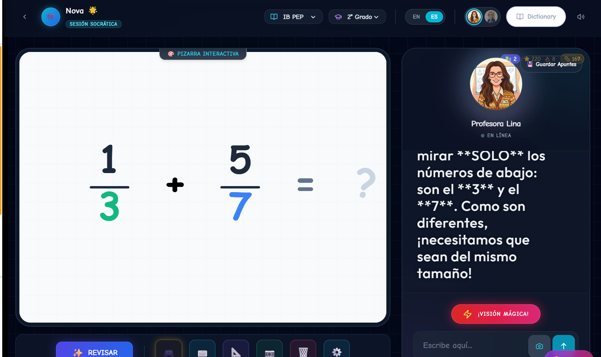

# Nova Schola: Ecosistema Educativo Inteligente
## Documento Técnico y Funcional para Instituciones Educativas

### 1. Visión General del Sistema
Nova Schola no es simplemente una aplicación de tareas; es un **Ecosistema de Aprendizaje Adaptativo** que integra tutoría académica personalizada, gamificación motivacional y supervisión parental avanzada en una única plataforma unificada. El sistema actúa como un "Compañero Inteligente" que guía al estudiante desde la instrucción hasta la práctica y la recompensa.

---

### 2. Arquitectura del Ecosistema (Cómo Funciona)

El sistema se divide en tres pilares interconectados que comparten información en tiempo real:

#### A. El Núcleo de Aprendizaje (Academic Core)
Este es el cerebro educativo de la plataforma.
*   **Tutor Matemático Socrático ("Lina"):** A diferencia de las calculadoras, Lina *no da la respuesta*. Utiliza un motor algorítmico híbrido para guiar al estudiante paso a paso.
    *   *Suma y Resta Avanzada:* Capacidad única para visualizar operaciones complejas en una "pizarra digital", enseñando conceptos como el "acarreo" y el "préstamo" de manera visual y lógica.
    *   *Detección de Errores:* Si el estudiante falla, el sistema diagnostica *por qué* (ej. error de cálculo vs. error de concepto) y ajusta la explicación.
*   **Research Center (Centro de Investigación):** Un asistente de IA seguro y curado que ayuda a los estudiantes a investigar temas de Ciencias y Sociales sin los riesgos de navegar en internet abierto.
*   **Buddy de Idiomas:** Un compañero conversacional para practicar inglés mediante diálogo natural, corregido en tiempo real.

#### B. El Motor de Motivación (Gamification Engine)
Diseñado para mantener el compromiso del estudiante mediante psicología positiva.
*   **Economía de Monedas (Nova Coins):** Cada ejercicio resuelto otorga monedas. Estas monedas *solo* se pueden gastar en recompensas aprobadas (ej. personalizar su avatar o tiempo de juego en la Arena).
*   **Sistema de Misiones:** Las tareas escolares (sincronizadas con Google Classroom) y las tareas domésticas (asignadas por padres) se convierten en "Misiones" con recompensas claras.
*   **La Arena:** Un espacio controlado de minijuegos educativos que se desbloquea *únicamente* tras cumplir objetivos académicos.

#### C. La Torre de Control (Supervisión Parental y Docente)
*   **Dashboard de Padres:** Ofrece una visión de "Rayos X" sobre el aprendizaje del niño.
    *   *Alertas de IA:* El sistema avisa proactivamente: *"Juan ha practicado mucho matemáticas, pero ha descuidado ciencias esta semana"*.
    *   *Control de Tareas:* Verificación de entrega de trabajos escolares en tiempo real.
*   **Reportes de Progreso:** Gráficas detalladas que muestran no solo las calificaciones, sino los hábitos de estudio, la persistencia y las áreas de dificultad.

---

### 3. Flujo de Datos y Seguridad

1.  **Entrada Unificada:** El estudiante inicia sesión y el sistema carga su "Perfil Dinámico" (Nivel académico, monedas, estado de ánimo de su mascota virtual).
2.  **Procesamiento Seguro:** Todas las interacciones con IA pasan por filtros de seguridad estrictos ("GuardianGuard") que bloquean contenido inapropiado y redirigen la conversación al tema de estudio.
3.  **Persistencia:** El progreso se guarda instantáneamente en la nube. Un estudiante puede empezar una misión en la tableta del colegio y terminarla en el computador de casa sin perder un solo paso.

### 4. Valor para las Instituciones
*   **Refuerzo Automático:** El sistema identifica debilidades en los estudiantes y asigna automáticamente ejercicios de refuerzo, liberando carga al docente.
*   **Visibilidad Total:** Los colegios obtienen datos reales sobre qué conceptos cuestan más trabajo a sus alumnos, permitiendo ajustar el currículo basado en evidencia.
*   **Conexión Hogar-Escuela:** Al integrar las tareas domésticas y escolares en un solo flujo de recompensas, Nova Schola alinea a padres y maestros en el mismo objetivo educativo.

---

### 5. Diagrama de Experiencia: El Primer Día (User Journey)

A continuación se detalla visualmente cómo interactúan el Estudiante y el Acudiente durante su primera sesión:

```mermaid
sequenceDiagram
    actor S as Estudiante
    participant NS as Nova Schola (Sistema)
    actor P as Acudiente (Padre)

    Note over S, NS: Fase 1: Entrada y Enganche
    S->>NS: Inicia Sesión por primera vez
    NS->>S: ¡Bienvenido! Crea tu Avatar
    S->>NS: Diseña su personaje (Pelo, Ropa)
    NS->>S: Misión Inicial: "Diagnóstico de Poder"
    S->>NS: Resuelve ejercicios de Matemáticas
    NS-->>S: ¡Nivel Calculado! (+100 Coins de Regalo)

    Note over S, P: Fase 2: Conexión Familiar
    S->>NS: Solicita "Vincular Acudiente"
    NS->>P: Envía Código de Invitación y Reporte 
    P->>NS: Se registra y Vincula la cuenta
    NS-->>P: Muestra Panel de Supervisión (Dashboard)
    
    Note over S, NS, P: Fase 3: El Ciclo Diario
    P->>NS: Asigna Misión: "Leer 20 minutos"
    NS->>S: Notificación: "¡Nueva Misión Especial!"
    S->>NS: Completa la Misión
    P->>NS: Valida la tarea (Check)
    NS->>S: Libera Recompensa (Coins + XP)
    S->>NS: Usa Coins para comprar mascota en la Tienda
```

*Este flujo garantiza que el padre esté involucrado desde el primer momento, convirtiendo el aprendizaje en una experiencia compartida y controlada.*

---
*Documento generado por el Equipo de Ingeniería de Nova Schola.*
